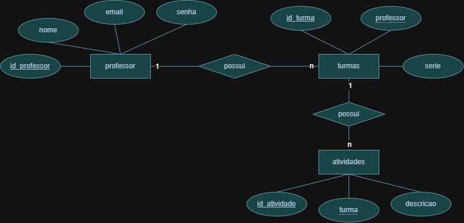
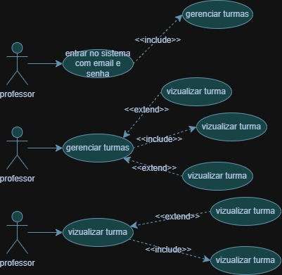
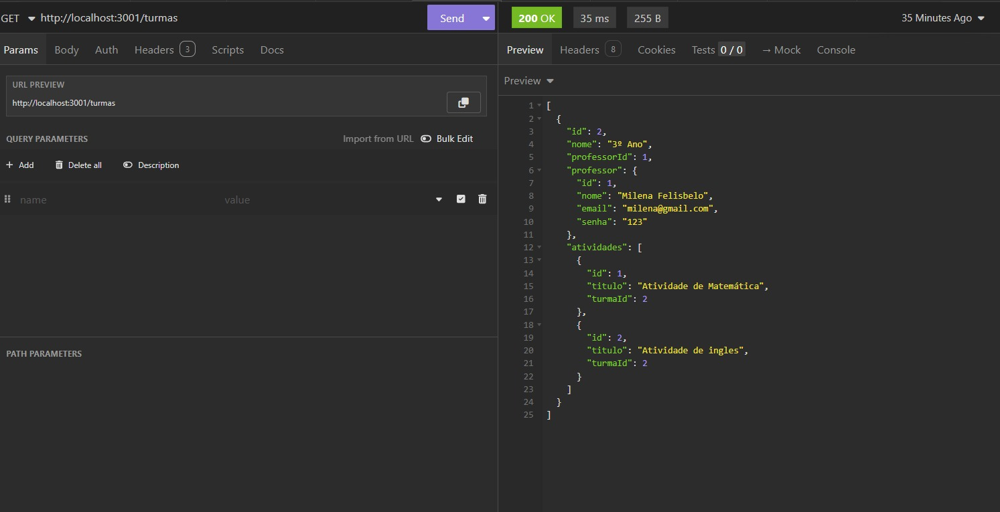
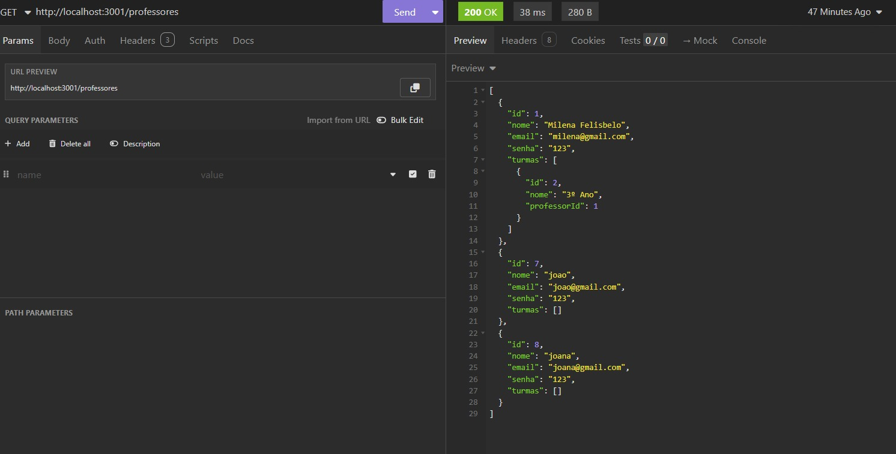

# Avaliação Prática: Sistema de Turmas e Atividades

### Objetivo
Criar um **sistema web full-stack** para controle de turmas e atividades de professores, permitindo que registrem, visualizem e excluam turmas e atividades.

### Contextualização
Em muitas escolas, especialmente em áreas remotas do Brasil, a ausência de um sistema organizado prejudica estudantes, professores e a gestão do conhecimento aplicado em sala de aula.

### Funcionalidades
- Autenticação de professores;
- Visualização, registro e exclusão de turmas;
- Registro de atividades por turma;
- Logout seguro.

---

## Infraestrutura Necessária

- **Banco de Dados:** MySQL 8.0+  
- **Servidor / SO:** Node.js 18+ em Windows 10/11  
- **Back-end:** Node.js, Express, Prisma ORM  
- **Front-end:** HTML, CSS  

---

## Instalação e Teste

1. **Clonar o repositório**  
```bash
git clone https://github.com/Milenafelisbelo/escolaavaliacao.git
cd escolaavaliacao
```
- DER


- UML


- Turmas


- Professores


- Atividades

